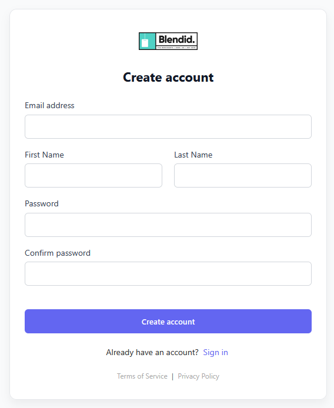
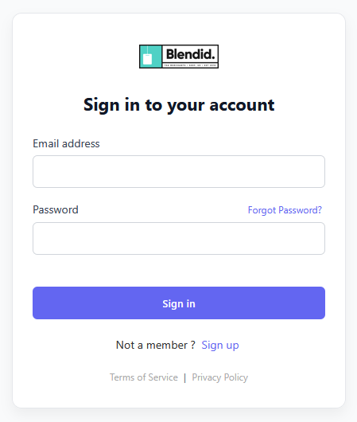
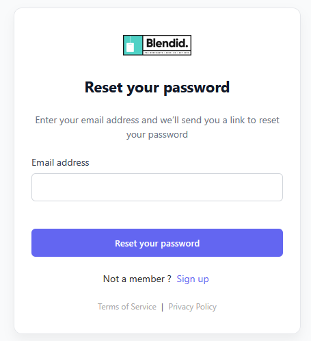
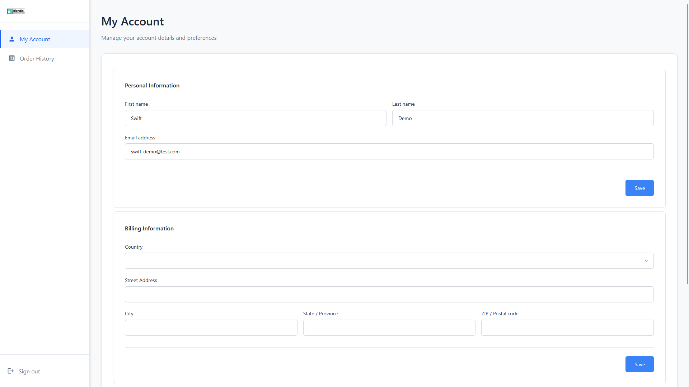
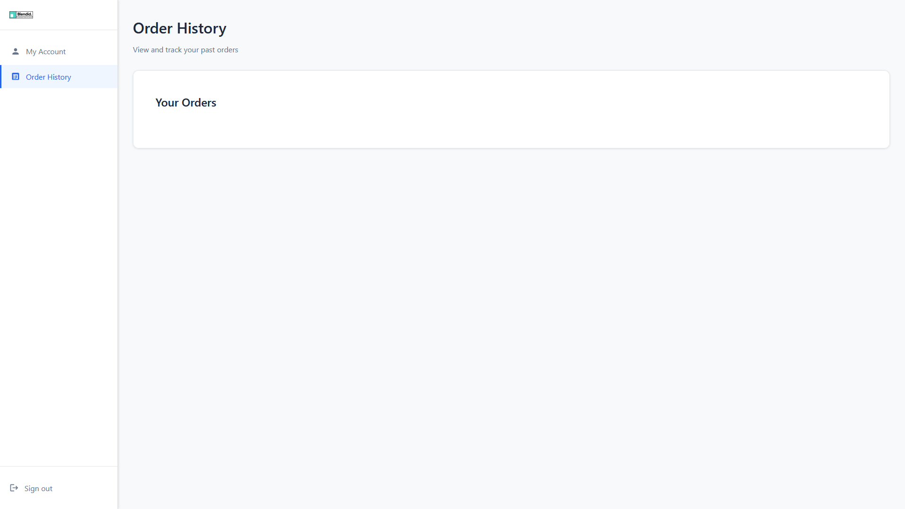

# Umbraco.Commerce.Portal

A ready made customer portal for Umbraco Commerce, allowing users to log in, manage their profiles and view order history.

## About

Umbraco Commerce Portal is an add-on package for Umbraco Commerce, providing customer with a fully customized and integrated solution for managing account details and order history.

## Installation

To install the customer portal, access the `Umbraco Commerce Portal` dashboard from the `Settings` section of the backoffice, and select the root node for the portal nodes to be installed under.

## Features

### Portal Authorization

The authorization area allows customers to perform one the following actions:

* Register

Upon registration, a confirmation email will be sent to the customer with a requirement for account confirmation:

* Login

* Reset Password

### Portal Management

The portal management area is a secure location only accessible to members of type `Customer`.

Within their private space, they are able to manage their account details and view order history.

My acount section offers support for handling personal information, update billing information or change password.

Under `Order History` the customer can review it's past orders and their details. These views are only with read-only purposes.

## Working locally

To fork and build your own Commerce Portal package, you will need:
* .NET 9.0 SDK or newer
* Umbraco 16.0.0 or newer
* Umbraco Commerce 16.0.0 or newer
* NodeJS 20+ for frontend development. Open `/src/Umbraco.Commerce.Portal/Client` folder and run `npm install; npm run build`

## Raising an Issue

If you find any issues with the Umbraco Commerce Checkout add-on itself please raise them in the [issues section of this repository](https://github.com/umbraco/Umbraco.Commerce.Portal/issues)

## License

Copyright © 2025 Umbraco

This demo store is [licensed under MIT](LICENSE.md). The core Umbraco Commerce product is licensed under Umbracos commercial license.
